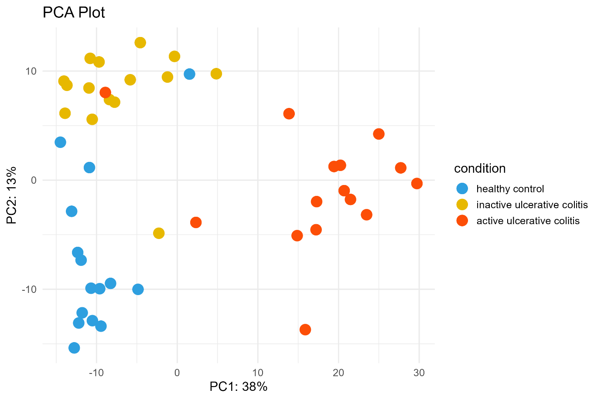
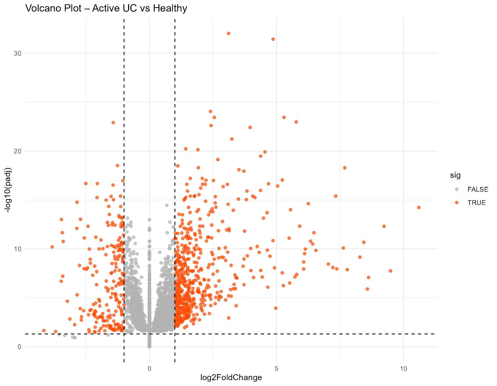
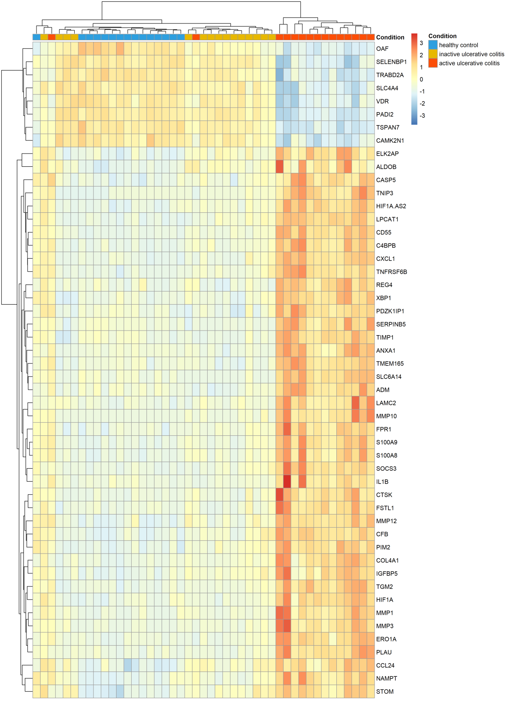
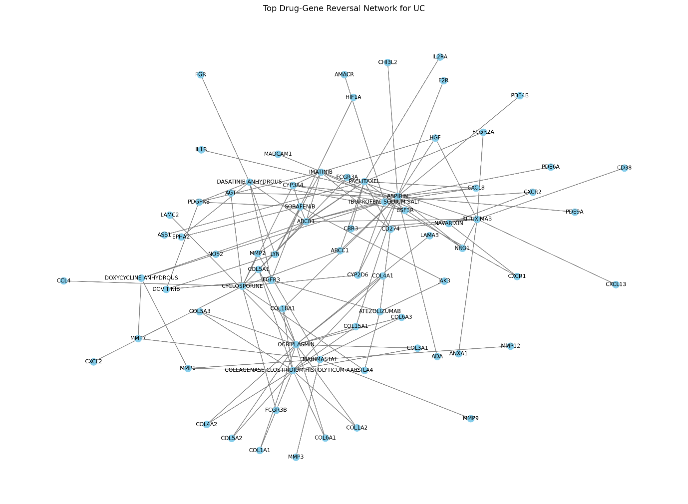

# AI-Guided Transcriptomic Drug Repurposing for Ulcerative Colitis

A computational transcriptomic drug-repurposing study integrating RNA-seq differential expression, drug–gene interaction analysis, network analysis, and exploratory machine learning to identify candidate therapeutic opportunities for ulcerative colitis.

## Overview

Ulcerative colitis (UC) is a chronic inflammatory bowel disease associated with recurring intestinal inflammation. This project investigated whether disease-associated transcriptomic signatures could be leveraged to prioritize existing drugs for potential repurposing.

The study used publicly available RNA-seq data from the Gene Expression Omnibus (GEO) dataset **GSE243625** and integrated differential expression analysis with drug–gene mapping, transcriptomic reversal scoring, network analysis, and unsupervised clustering.

## Dataset

**GEO Accession:** GSE243625

**Samples:** 45 colonic biopsy samples

- 15 Active Ulcerative Colitis
- 15 Inactive Ulcerative Colitis
- 15 Healthy Controls

## Analytical Workflow

```text
GEO RNA-seq Data
        ↓
Data Preprocessing & Filtering
        ↓
Differential Expression Analysis
        ↓
DESeq2 + apeglm Shrinkage
        ↓
Significant DEG Identification
        ↓
Drug–Gene Interaction Mapping
        ↓
Transcriptomic Reversal Scoring
        ↓
Drug–Gene Network Analysis
        ↓
K-means Clustering
        ↓
Candidate Drug Prioritization
```

## Key Results

Differential expression analysis identified:

- **749 significant DEGs**
- **542 upregulated genes**
- **207 downregulated genes**

The analysis highlighted disease-associated genes including **SERPINB7, S100A8, S100A9, MMP1, and REG4**.

Drug–gene integration and reversal-oriented scoring generated a ranked set of candidate repurposing opportunities. Among the highest-ranked candidates were:

**Aspirin • Collagenase clostridium histolyticum-AAES • Marimastat • Dasatinib • Sorafenib • Atezolizumab • Imatinib • Rituximab • Cyclosporine • Navarixin**

An exploratory **K-means clustering** analysis was also performed to investigate transcriptomic subgroup structure within the dataset.

> Drug candidates identified in this study are computationally prioritized hypotheses and are not validated therapeutic recommendations.

## Selected Results

### Principal Component Analysis

PCA of variance-stabilized expression profiles showed separation among active ulcerative colitis, inactive ulcerative colitis, and healthy control samples.

<p align="center">
  
</p>

### Differential Expression Landscape

The volcano plot summarizes the statistical significance and magnitude of gene-expression changes in the active ulcerative colitis versus healthy control comparison.

The analysis identified **749 significant DEGs** using `padj < 0.05` and `|log2FC| > 1`, with **542 upregulated** and **207 downregulated** genes.

<p align="center">
  
</p>

### Transcriptomic Expression Patterns

The top-50 DEG heatmap shows distinct expression patterns across the 45 samples, with active ulcerative colitis samples exhibiting a strong inflammatory transcriptional signature and healthy controls showing contrasting expression profiles.

<p align="center">
  
</p>

### Drug–Gene Interaction Network

The drug–gene interaction network connects prioritized candidate drugs with their associated target genes, providing a network-level view of the relationships underlying the computational repurposing analysis.

<p align="center">
  
</p>

## Explore the Results

- [DEG Summary](results/DEG_summary.csv) — summary of significant, upregulated, and downregulated genes
- [Drug Ranking](results/drug_ranking.csv) — ranked candidate drugs with reversal score, target count, and final score
- [Analysis Workflow](analysis/README.md) — detailed computational workflow and methods
- [Dataset Information](data/README.md) — GEO accession and sample composition
  
## Methods & Tools

### Transcriptomic Analysis
- RNA-seq
- DESeq2
- apeglm
- Variance Stabilizing Transformation (VST)
- Differential Gene Expression
- GEO

### Computational Analysis
- R
- Python
- Pandas
- scikit-learn
- NetworkX

### Visualization
- ggplot2
- pheatmap

## Repository Contents

```text
├── analysis/    # Analysis documentation
├── data/        # Dataset information and metadata
├── figures/     # Selected study figures
├── results/     # Result tables and outputs
├── docs/        # Supporting project documentation
└── LICENSE
```

## Reproducibility

The original analysis was developed and executed in the author's local computational environment during the dissertation project. The original analysis scripts are not currently available in this repository.

Accordingly, this repository is intended as a **research and portfolio documentation of the completed study**, rather than a fully reproducible code package.

The repository contains selected figures, results, and supporting documentation from the completed analysis.

## Limitations

- The analysis was based on a single bulk RNA-seq dataset.
- Bulk RNA-seq does not provide cell-type-level resolution.
- Drug prioritization was computational and hypothesis-generating.
- The scoring framework did not account for pharmacokinetics, safety, dosing, or tissue delivery.
- The exploratory clustering analysis requires validation using independent datasets.
- Experimental and clinical validation is required before therapeutic conclusions can be drawn.

## Future Directions

Potential extensions include independent cohort validation, single-cell and multi-omics integration, advanced drug-response modelling, and experimental validation of prioritized candidates.

## Author

**Jatin Rao Kunekar**

M.Sc. Bioinformatics  
Garden City University, Bengaluru

[LinkedIn](https://www.linkedin.com/in/jatin-rao-77757622/) · [GitHub](https://github.com/jathinraokunekar150-alt)
