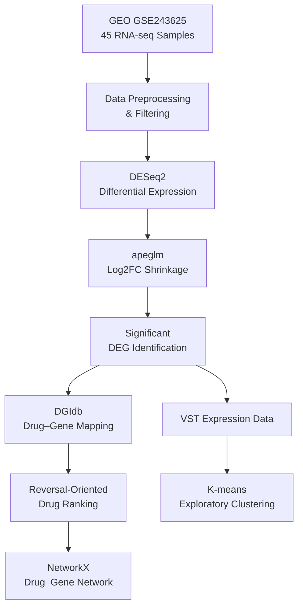

# Analysis Workflow

This document summarizes the computational workflow used in the completed dissertation project.

The analysis combined **R-based transcriptomic analysis** with **Python-based drug repurposing, network analysis, and exploratory clustering**.

## 1. Data Acquisition & Preprocessing

The study used publicly available RNA-seq count data from **GEO accession GSE243625**, comprising 45 colonic mucosal biopsy samples:

- 15 Active Ulcerative Colitis
- 15 Inactive Ulcerative Colitis
- 15 Healthy Controls

Preprocessing included:

- Gene identifier formatting
- Removal of genes with zero expression across all samples
- Alignment of expression data with sample metadata
- Categorical encoding of experimental conditions
- Low-expression filtering

Healthy controls were used as the reference condition for differential expression analysis.

## 2. Differential Expression Analysis

Differential expression analysis was performed in **R** using **DESeq2**.

Key settings included:

- Design formula: `~ condition`
- Log2 fold-change shrinkage: `apeglm`
- Minimum count filter: `10`
- Significance threshold: `padj < 0.05`
- Effect-size threshold: `|log2FC| > 1`

Variance-stabilizing transformation (**VST**) was used for downstream exploratory analysis.

## 3. Transcriptomic Visualization

The analysis generated multiple visualizations to characterize the transcriptomic patterns across the dataset:

- Principal Component Analysis (PCA)
- Sample-to-sample distance heatmap
- Volcano plot
- MA plot
- DESeq2 dispersion plot
- Heatmap of the top 50 differentially expressed genes
- Bar plot of the top 20 upregulated and downregulated genes

These visualizations were used to assess global expression patterns, differential-expression magnitude and significance, and sample-level clustering.

## 4. Drug–Gene Mapping & Repurposing

Significant differentially expressed genes were mapped to drug–gene interactions derived from the **Drug–Gene Interaction Database (DGIdb)**.

A reversal-oriented scoring strategy was then used to prioritize candidate drugs based on the magnitude of gene-expression changes and the number of relevant drug targets.

The documented scoring formulation was:

```text
Final Score = Σ |log₂(Fold Change)| × Number of Targets
```
The resulting scores were used to generate a ranked set of candidate drug-repurposing hypotheses.

## 5. Network Analysis

A bipartite drug–gene interaction network was constructed using NetworkX.

The network was used to visualize relationships between prioritized drugs and their associated target genes and to support interpretation of the drug-repurposing results.

## 6. Exploratory Subgroup Analysis

Variance-stabilized expression data were analyzed using **K-means clustering** to explore potential transcriptomic subgroups within the dataset.

The clustering configuration documented in the dissertation was:

```text
n_clusters = 2
random_state = 42
```
The resulting clusters were interpreted as exploratory expression-based subgroups and were not treated as clinically validated molecular subtypes.

## Software & Packages

### R
- DESeq2
- apeglm
- ggplot2
- pheatmap

### Python
- Python 3.13.13
- pandas
- scikit-learn
- NetworkX

## Workflow Summary


Note - This repository documents the completed analytical workflow and associated research outputs rather than providing the original executable source code.


